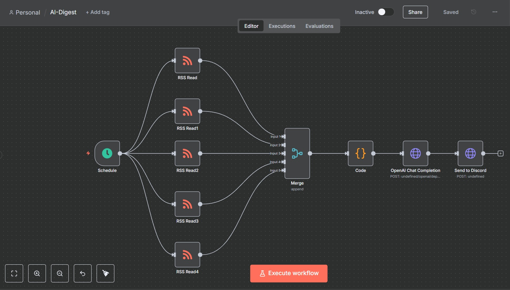

# AI News Digest for Discord



A self-hosted n8n workflow that pulls the latest headlines from five RSS feeds each evening, sends them to a deployed GPT-4 model on Azure OpenAI to produce a concise bullet-point summary, and posts the result to a Discord channel.

## Features

*   **Daily Summary:** Triggered by a KEDA cron scaler at 20:00 Europe/London time.
*   **Fully Serverless-Style:** Deployed using Azure Container Apps for cost-effective, on-demand execution.
*   **Secure Credential Storage:** Uses Azure Container App Secrets to manage all API keys and URLs.
*   **Direct Summarization Pipeline:** Leverages a deployed Azure OpenAI GPT-4 model for high-quality summaries.
*   **Local Development:** Fully containerized with Docker for consistent local testing.

## Architecture

KEDA Cron Scaler (Azure) -> Container App -> n8n Workflow -> Azure OpenAI -> Discord Webhook


**Components:**

*   **n8n Workflow (`ai-digest.json`):** The core automation logic that fetches, summarizes, and posts.
*   **KEDA Cron Scaler:** The trigger mechanism within Azure that wakes the container app on a schedule.
*   **Azure Container App Secrets:** Securely stores all API keys, URLs, and credentials.
*   **Azure OpenAI Service:** Hosts the `gpt-4` model deployment used for summarization.
*   **Discord Webhook:** The interface used to post the final summary message to a Discord channel.

## Prerequisites

1.  An Azure account with permissions to create resources.
2.  A Discord server where you have permission to create webhooks.
3.  Local tools if developing locally:
    *   Azure CLI (for logging into the container registry)
    *   Docker Desktop (for building and running the container image)


## Setup

1.  **Clone this repository:**

    ```bash
    git clone <repository-url>
    cd <repository-folder>
    ```

2.  **Create a Discord Webhook:**
    *   In your Discord server, go to `Server Settings` > `Integrations` > `Webhooks`.
    *   Click `New Webhook`, give it a name (e.g., "AI News Bot"), and choose the channel for posting.
    *   Click `Copy Webhook URL` and save it for the `.env` file and Azure secrets.

3.  **Set up Azure OpenAI:**
    *   In the Azure Portal, create an **Azure OpenAI** resource.
    *   Navigate to the **Azure AI Studio** for that resource.
    *   Go to **Deployments** and create a new deployment, selecting a `gpt-4` model. Give it a clear deployment name (e.g., `gpt-4-summarizer`).

4.  **Configure Azure Container Registry (ACR):**
    *   In the Azure Portal, create a **Container Registry** resource. The `Basic` SKU is sufficient.
    *   Note the unique name you give it (e.g., `aidigestregistry`).

## Build and Deploy

1.  **Build and Push the Docker Image:**
    *   Log in to your registry from your terminal:
        ```bash
        az acr login --name <your-registry-name>
        ```
    *   Build the image:
        ```bash
        docker build -t n8n-ai-news .
        ```
    *   Tag the image for your registry:
        ```bash
        docker tag n8n-ai-news <your-registry-name>.azurecr.io/n8n-ai-news:latest
        ```
    *   Push the image:
        ```bash
        docker push <your-registry-name>.azurecr.io/n8n-ai-news:latest
        ```

2.  **Deploy to Azure Container Apps:**
    *   In the Azure Portal, **Create a Container App**.
    *   On the **Container** tab, point it to the image in your ACR. Use `Managed identity` for authentication.
    *   On the **Ingress** tab, enable ingress on port `5678`.
    *   After creation, navigate to the app's **Secrets** page and create secrets for your credentials using `lowercase-with-hyphens` (e.g., `openai-api-key`).
    *   Navigate to the **Container** page, click **Edit and deploy**, and add **Environment Variables** that reference the secrets you created.
    *   Navigate to the **Scale** page, set min replicas to `0`, and add a `Cron` KEDA scaler to run on your schedule.


## Testing and Verification

1.  **Manual Trigger in Azure:**
    *   Navigate to the **Application Url** of your Container App. This will wake the container from zero.
    *   Log in to the n8n UI. The workflow will appear on the canvas.
    *   Press **Execute Workflow** to run the job manually.
2.  **Check Logs:** View the container logs in the Azure Portal under the **Log stream** menu of your Container App.
3.  **Verify Output:** Check your Discord channel for the AI-generated summary.

## Local Development

You must create a `.env` file in the project root for local testing (this is ignored by Git).

* The Endpoint from the AI Studio's "View code" pop-up for your deployment
OPENAI-BASE-URL=https://<your-resource-name>.openai.azure.com

* The exact name you gave your model deployment in the AI Studio
OPENAI-DEPLOYMENT=<your-deployment-name>

* The key from the AI Studio's "View code" pop-up
OPENAI-API-KEY=<your-api-key>

* The webhook URL you copied from Discord
DISCORD-WEBHOOK-URL=<your-discord-webhook-url>```

* Invoke the container locally with:

docker run --rm -it -p 5678:5678 --env-file .env n8n-ai-news

## Further Notes

* Schedule: To change the time, update the cron expression in both the KEDA scaler in Azure and the Schedule node in ai-digest.json.
* AI Model: To use a different model, create a new deployment in Azure OpenAI and update the openai-deployment secret.
* Summary Prompt: To change the instructions for the AI, edit the jsCode parameter in the Code node in ai-digest.json.
* RSS Feeds: To add or change news sources, edit the url parameter in the various RSS Read nodes in ai-digest.json.